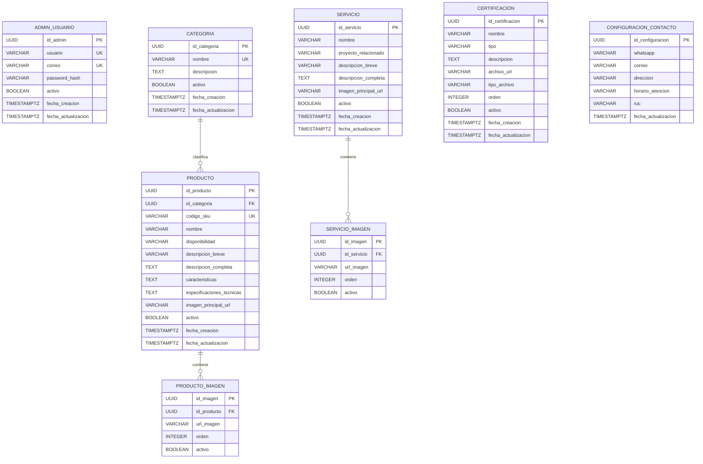

# Modelo de datos

## Diagrama entidad-relación



## Relaciones

| Origen | Relación | Destino | Regla |
|---|---:|---|---|
| `categoria` | 1:N | `producto` | Un producto pertenece a una categoría obligatoria. |
| `producto` | 1:N | `producto_imagen` | Las imágenes secundarias se eliminan en cascada con el producto a nivel de BD. |
| `servicio` | 1:N | `servicio_imagen` | Máximo funcional de tres imágenes adicionales. |

## Reglas persistentes

- `producto.codigo_sku` es único.
- `categoria.nombre` es único ignorando mayúsculas, espacios extremos y espacios repetidos.
- `producto.disponibilidad` solo permite `DISPONIBLE` o `NO_DISPONIBLE`.
- `certificacion.tipo_archivo` solo permite `PDF` o `IMAGEN`.
- Los campos `orden` deben ser mayores o iguales a uno.
- WhatsApp contiene entre 9 y 15 dígitos.
- RUC, cuando existe, contiene 11 dígitos.
- El contenido se desactiva lógicamente; la API no ofrece borrado físico de categorías, productos, servicios o certificaciones.

## Índices

- Categoría: estado y nombre.
- Producto: categoría, estado/disponibilidad, nombre y SKU único.
- Galerías: entidad padre y orden.
- Servicio: estado y nombre.
- Certificación: estado y orden.

## Uso de `configuracion_contacto`

Esta tabla contiene la información global que se muestra en el footer, la página de contacto y los botones de cotización por WhatsApp. No almacena una URL de Google Maps. El frontend consulta un único registro y reutiliza sus datos en todas esas secciones.

## Decisión sobre características y especificaciones

En esta versión se almacenan como `TEXT`, permitiendo saltos de línea o contenido estructurado simple. Si posteriormente se necesitan filtros técnicos por atributo, se recomienda migrar a:

```text
producto_especificacion
- id_especificacion UUID PK
- id_producto UUID FK
- nombre VARCHAR(100)
- valor VARCHAR(250)
- unidad VARCHAR(30)
- orden INTEGER
```

No se agrega en la primera versión para mantener el alcance del catálogo y evitar complejidad innecesaria.
